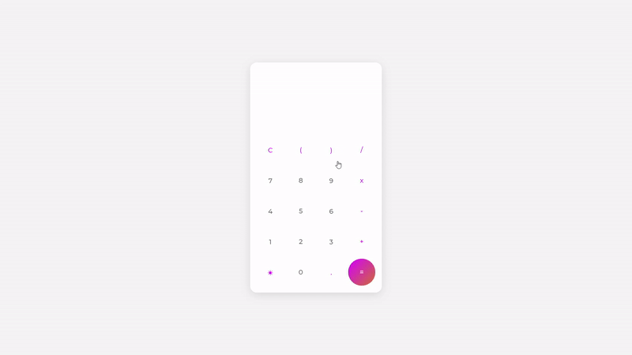

## 📖 Projeto

O projeto consiste em uma calculadora que efetua operações aritméticas básicas.
O projeto foi baseado no (tutorial)[https://www.youtube.com/watch?v=ZtHyhj2tQUE]

## 🧪 Tecnologias

Esse projeto foi desenvolvido com as seguintes tecnologias e bibliotecas:

- [React](https://reactjs.org)

## 🚀 Como executar

Clone o projeto e acesse a pasta do mesmo.

```bash
$ git clone https://github.com/d0ugui/calculadora.git
$ cd calculadora
```

Para iniciá-lo, siga os passos abaixo:

```bash
# Instalar as dependências
$ yarn or npm i

# Iniciar o projeto
$ yarn start or npm start
```

O app estará disponível no seu browser pelo endereço http://localhost:3000/

## 📝 License

Esse projeto está sob a licença MIT.
